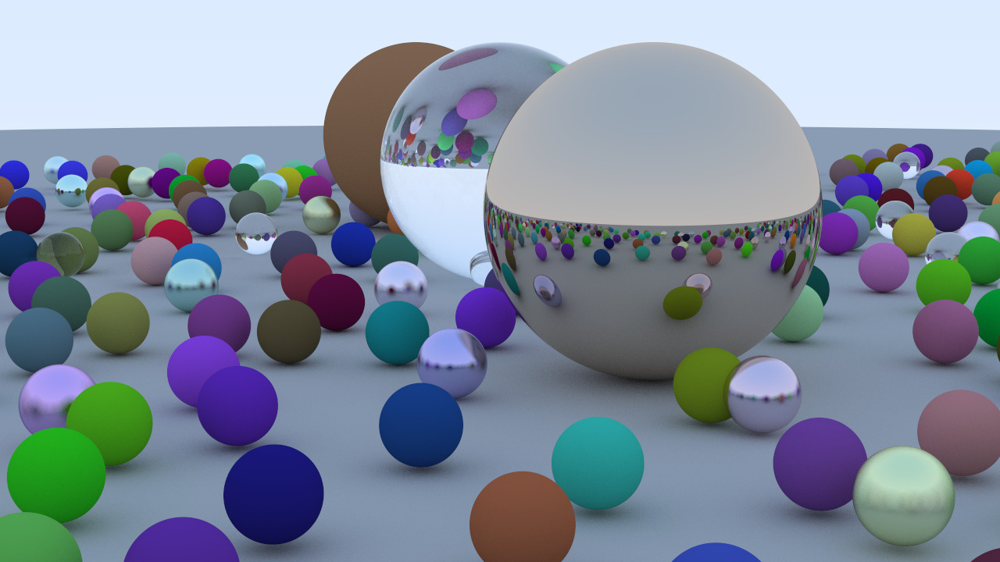

# Raze Renderer

A CPU-based ray tracing renderer written in C++, built by following the book [_Ray Tracing in One Weekend_](https://raytracing.github.io/books/RayTracingInOneWeekend.html).
Raze extends the original implementation with performance improvements and structural changes, most notably a multithreaded rendering pipeline for faster image generation.


## Overview
Raze is a minimal ray tracer that renders photorealistic images using pure CPU computation — no graphics APIs (OpenGL, Vulkan, DirectX) are used. It features:

* CPU-based ray tracing
* Diffuse, metallic, and dielectric materials
* Anti-aliasing
* Multithreaded rendering
* No external graphics libraries

Below is a sample render produced by Raze:



## Getting Started

### Dependencies
  
* C++20 compatible compiler
* CMake

No external libraries are required.

### Building the Project

```
git clone https://github.com/0point055ton/Raze.git
cd Raze
mkdir build
cd build
cmake ..
make
```

### Running the Renderer

* After building:
```
./raze
```
* The rendered image will be saved as PPM file:
```
final.ppm
```

## Reference

Based on:\
Peter Shirley — Ray Tracing in One Weekend\
https://raytracing.github.io/books/RayTracingInOneWeekend.html
