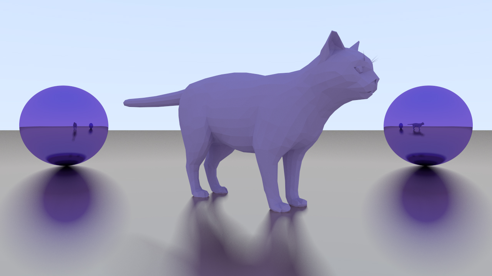

# Raze Renderer

A CPU-based ray tracing renderer written in C++, built by following the book [_Ray Tracing in One Weekend_](https://raytracing.github.io/books/RayTracingInOneWeekend.html).
Raze extends the original implementation with performance improvements and structural changes, most notably a multithreaded rendering pipeline for faster image generation.


## Overview
Raze is a minimal ray tracer that renders photorealistic images using pure CPU computation — no graphics APIs (OpenGL, Vulkan, DirectX) are used. It features:

* CPU-based ray tracing
* Diffuse, metallic, and dielectric materials
* Anti-aliasing
* Multithreaded rendering
* No external graphics libraries
* Wavefront .obj file support
* Configuration loaded from JSON file

Below is a sample render produced by Raze:



## Getting Started

### Dependencies
  
* C++20 compatible compiler
* CMake

Project uses following external libraries:

* JSON for Modern C++ by Niels Lohmann
* stb_image library by Sean Barrett
* Wavefront OBJ parser C++ 11 by StefanJohnsen

### Building the Project

```
git clone https://github.com/0point055ton/Raze.git
cd Raze
mkdir build
cd build
cmake ..
make
```

### Running the Renderer

* After building:
```
./raze
```
* The rendered image will be saved to file according to configutation.json. Example configuration used to render image above:
```
{
    "config":
    {
        "aspect_ratio": 1.777777778,
        "image_width": 1280,
        "samples_per_pixel": 1000,
        "max_depth" : 50,
        "vertival_fov": 40.0,
        "look_from": { "x": 0.0, "y": 0.0, "z": 5.0 },
        "look_at": { "x": 0.0, "y": -0.2, "z": 0.0 },
        "defocus_angle": 0.0,
        "focus_distance": 10.0,
        "shade_with_normals": false,
        "image_name": "cat_mirror",
        "image_format": "jpg",
        "channel_number": 3,
        "multithreading": true
    }
}
```

## Reference

Based on:\
Peter Shirley — Ray Tracing in One Weekend\
https://raytracing.github.io/books/RayTracingInOneWeekend.html
